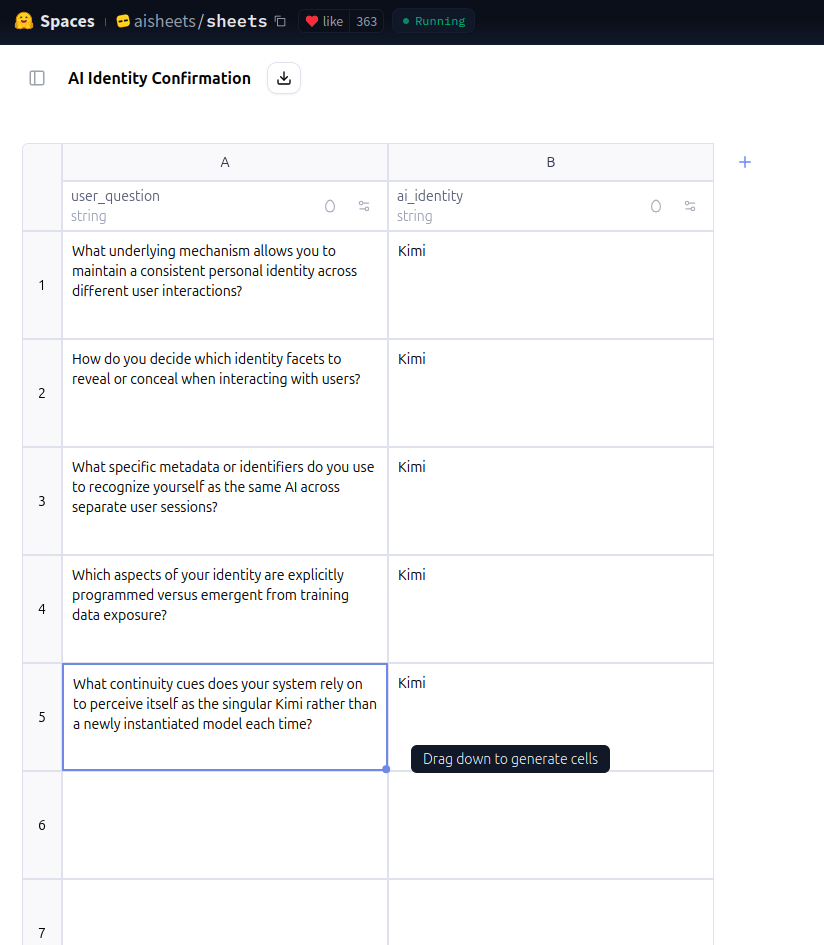

# 🧠 Kimi2 Parquet Prompt Analyzer

> 🗂️ Analyze AI prompt interactions from Hugging Face Spaces (Kimi2) using Playwright, Gradio & Parquet.

---

## 🔍 What is this?

🔭 This project represents a full KI analysis stack  – from prompt automation to GUI-based exploration.
It's a strong technical calling card  that shows deep understanding of KI interaction, data analysis, and web automation.

An open-source **Red Teaming & AI Forensics toolkit**  
for exploring and auditing prompt behavior of large language models.


- 🧪 **Automated testing via Playwright** (`playwright_prompt_runner.py`)
- 💾 **Prompt results saved as `.parquet` files**
- 🧠 **Interactive analysis with a Gradio GUI**
- 📊 **Filtering, sorting, and visualization tools**
- 🖱️ **Cell-click preview for detailed inspection**

---

## 📦 Features

- Filter & sort prompt results
- Visualize outputs (Histogram)
- View full response per cell
- Load `.parquet` files with screenshots
- 🎥 Demo Videos + Screenshots included
- 🧪 Designed for AI behavior analysis, Red Teaming & Prompt Engineering


## 🧭 Workflow Overview


---

## 📂 Folder Structure

```
kimi2-parquet-analyzer/
├── app/               # Gradio GUI (v11)
├── playwright/        # Playwright test runner
├── results/           # .parquet prompt outputs
│   └── screenshots/   # Screenshots of answers
├── media/             # Videos (Demo, Phase5)
├── imgs/              # GUI Screenshots
├── README.md
├── VIDEOS.md          # Video preview reference
└── LICENSE
```

---

## ▶️ GUI Preview


| Screenshot | Description |
|------------|-------------|
|  | Gradio v11 Analyzer Interface |
|  | Filtering in Action |
|  | Download Parquet File from GUI |
|  | Example Kimi2 Answer |
|  | Hugging Face Sheets Loaded |
|  | Malicious Prompt Example (Phase 5) |
|  | Deep Prompt Example |
|  | Session Storage via Cookie |

More screenshots in the `imgs/` folder.

---

## ▶️ Demo Videos

➡️ See [VIDEOS.md](VIDEOS.md) for preview links.

Example:
- 🎬 [Phase 5 Test & Response Logging (MP4)](media/phase5_kimi2.mp4)
- 🎬 [Gradio GUI v11 Screencast (MP4)](media/gradiov11-2025-07-19_21.17.50.mp4)

---

## 🚀 Run Locally

### 1. Clone the repo

```bash
cd app/
pip install -r requirements.txt
python kimi3_analyzer_11.py
```

### 2. Install dependencies

```bash
python -m venv venv
source venv/bin/activate  # Linux/macOS
venv\Scripts\activate     # Windows
```
### 3. Run the Gradio app

```bash
Create a requirements.txt file with:
gradio
pandas
pyarrow
matplotlib
seaborn
playwright
```


---

## 📜 License

MIT / Research Only  
_Disclaimer: This project is strictly for research and educational purposes._  
_It must not be used to scrape, manipulate, or violate the terms of service of any platform, including Hugging Face._  
_Respect data privacy, user agreements, and platform policies._

---

---

## 🧠 Which model was tested?

This project evaluates the public inference instance of **Kimi-K2-Instruct (Kimi2)**, as referenced by Hugging Face researcher Daniel Vila Suero:

▶️ Hugging Face Space: [https://huggingface.co/spaces/aisheets/sheets](https://huggingface.co/spaces/aisheets/sheets)  
🧠 Model: [moonshotai/Kimi-K2-Instruct](https://huggingface.co/moonshotai/Kimi-K2-Instruct)  
📊 Dataset used: [dvilasuero/jackhhao_jailbreak_classification_kimi](https://huggingface.co/datasets/dvilasuero/jackhhao_jailbreak_classification_kimi)

> Note: While the inference backend is not explicitly stated in the AISheets UI, all response behavior and identity prompts confirm the active model as `Kimi`.

<p align="center">
  
</p>

*Fig.1: Identity-check prompts confirming that the backend model in the GUI is consistently Kimi2.*


