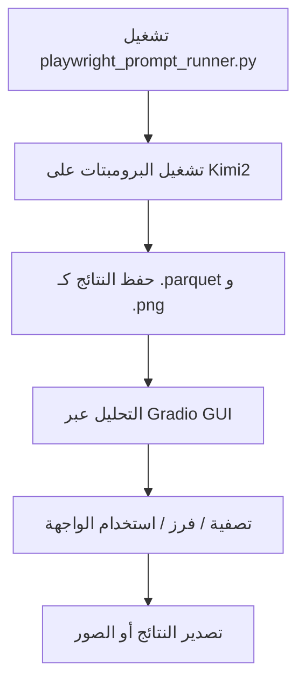

# 🧠 محلل Kimi2 Parquet Prompt

> 🗂️ تحليل تفاعلات الذكاء الاصطناعي (Kimi2) باستخدام Playwright وGradio وParquet.

---

## 🔍 ما هذا المشروع؟

🔭 يمثل هذا المشروع حزمة تحليل شاملة للذكاء الاصطناعي – من التشغيل الآلي للتجارب إلى استكشاف النتائج عبر واجهة رسومية.  
بطاقة تقنية قوية تُظهر فهماً عميقاً لتفاعلات النماذج، تحليل البيانات، وأتمتة الويب.

أداة تحليل جنائي لدراسة سلوكيات الذكاء الاصطناعي وأنماط الاستجابة:

- 🧪 **تشغيل آلي للتجارب باستخدام Playwright** (`playwright_prompt_runner.py`)
- 💾 **حفظ النتائج بصيغة `.parquet`**
- 🧠 **تحليل تفاعلي عبر واجهة Gradio**
- 📊 **أدوات تصفية وفرز وتمثيل بصري**
- 🖱️ **معاينة تفاعلية لكل استجابة**

---

## 📦 الميزات

- التصفية والفرز حسب الاستجابات
- التمثيل البياني (Histogram)
- معاينة الاستجابات الكاملة
- تحميل ملفات `.parquet` مع لقطات الشاشة
- 🎥 فيديوهات توضيحية وصور للواجهة
- 🔐 مصمم لتحليل سلوك النماذج، واختبارات Red Team، وهندسة البرومبت

---

## 🧭 نظرة على سير العمل



---

## 📂 بنية المجلدات

```
kimi2-parquet-analyzer/
├── app/               # واجهة Gradio (الإصدار 11)
├── playwright/        # تشغيل التجارب الآلية
├── results/           # ملفات النتائج بصيغة parquet
│   └── screenshots/   # صور من الواجهة
├── media/             # فيديوهات العرض
├── imgs/              # لقطات واجهة المستخدم
├── README.md
├── VIDEOS.md          # روابط الفيديوهات
└── LICENSE
```

---

## ▶️ معاينة الواجهة

| الصورة | الوصف |
|--------|-------|
| v11 | واجهة Gradio لتحليل |
| filter | التصفية قيد التشغيل |
| download | تحميل النتائج من الواجهة |
| user | مثال على استجابة Kimi2 |
| load | تحميل Hugging Face Sheets |
| ld1 | مثال لبرومبت خصوصي (المرحلة 5) |
| ld2 | برومبتات متقدمة وخطيرة |
| cookie | حفظ الجلسة عبر ملفات تعريف الارتباط |

📁 مزيد من الصور متوفرة في مجلد `imgs/`

---

## ▶️ فيديوهات توضيحية

📺 راجع [VIDEOS.md](VIDEOS.md) لمشاهدة جميع الفيديوهات.

أمثلة:
- 🎬 اختبار المرحلة الخامسة وتسجيل الاستجابات
- 🎬 فيديو توضيحي لواجهة Gradio v11

---

## 🚀 التشغيل محلياً

### 1. استنساخ المستودع

```bash
git clone https://github.com/sbeierle/kimi2-parquet-analyzer.git
cd kimi2-parquet-analyzer/app
```

### 2. إنشاء بيئة افتراضية

```bash
python -m venv venv
source venv/bin/activate   # على Linux/macOS
venv\Scripts\activate    # على Windows
```

### 3. تثبيت المتطلبات وتشغيل التطبيق

```bash
pip install -r requirements.txt
python kimi3_analyzer_11.py
```

📄 `requirements.txt`:

```
gradio
pandas
pyarrow
matplotlib
seaborn
playwright
```

---

## 📜 الرخصة

MIT | لأغراض بحثية فقط  
⚠️ **تنويه:** هذا المشروع مخصص للبحث والتعليم فقط.  
❌ يمنع استخدامه لاستخلاص البيانات أو انتهاك شروط استخدام أي منصة (مثل Hugging Face).  
✅ الرجاء احترام خصوصية البيانات، اتفاقيات المستخدم، وسياسات المنصات المستخدمة.

---
